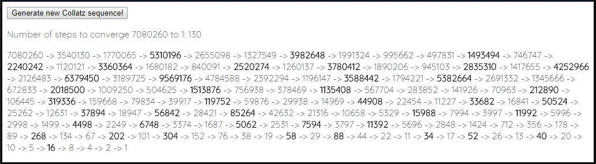

# An simple Collatz Sequence generator

This javascript program generate a Collatz sequence and display on the HTML file with a typing write effect.

This animation is on http://volfeganbox.byethost14.com/projects.html on the section Collatz conjecture.

Use this program as you see fit.